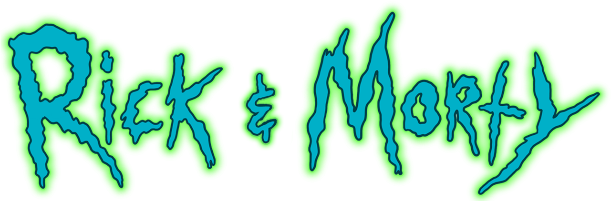

# Rick and Morty: Проводник по персонажам



Это веб-приложение для исследования персонажей популярного мультсериала "Рик и Морти". Пользователи могут просматривать список персонажей, фильтровать их по различным критериям и просматривать подробную информацию о каждом из них.

## ✨ Ключевые особенности

- **Список персонажей:** Просматривайте всех персонажей из вселенной Рика и Морти с бесконечной прокруткой для удобного просмотра.
- **Фильтрация:** Легко находите персонажей, фильтруя их по:
  - Имени
  - Статусу (Жив, Мертв, Неизвестно)
  - Виду
  - Полу
- **Подробный просмотр персонажа:** Нажмите на любого персонажа, чтобы увидеть отдельную страницу с дополнительной информацией, включая его происхождение, местоположение и увеличенное изображение.
- **Поиск в реальном времени:** Список персонажей обновляется мгновенно по мере ввода текста или выбора фильтров.
- **Состояния загрузки и "Не найдено":** Интерфейс обеспечивает четкую обратную связь с помощью индикаторов загрузки во время получения данных и сообщения, когда персонажи, соответствующие выбранным фильтрам, не найдены.

## 🚀 Демо-версия

https://shemzoo.github.io/rick-and-morty-app/

## 🛠️ Используемые технологии

- **Фронтенд:**
  - [React](https://reactjs.org/)
  - [TypeScript](https://www.typescriptlang.org/)
  - [Vite](https://vitejs.dev/)
- **Стилизация:**
  - [Sass (SCSS)](https://sass-lang.com/) с CSS Modules
- **Маршрутизация:**
  - [React Router](https://reactrouter.com/)
- **Получение данных:**
  - [Axios](https://axios-http.com/)
- **Библиотеки:**
  - [react-infinite-scroll-component](https://github.com/ankeetmaini/react-infinite-scroll-component) для бесконечной прокрутки.
  - [react-hot-toast](https://react-hot-toast.com/) для уведомлений.
- **Качество кода:**
  - [ESLint](https://eslint.org/)
  - [Prettier](https://prettier.io/)

## ⚙️ Начало работы

Чтобы запустить локальную копию проекта, выполните следующие простые шаги.

### Требования

- [Node.js](https://nodejs.org/en/) (версия 18.x или выше)
- [npm](https://www.npmjs.com/) или [yarn](https://yarnpkg.com/)

### Установка

1.  Склонируйте репозиторий:
    ```sh
    git clone https://github.com/ваш-username/rick-and-morty-app.git
    ```
2.  Перейдите в каталог проекта:
    ```sh
    cd rick-and-morty-app
    ```
3.  Установите зависимости NPM:
    ```sh
    npm install
    ```

### Запуск приложения

- Чтобы запустить приложение в режиме разработки:

  ```sh
  npm run dev
  ```

## 📁 Структура проекта

```

src/
├── api/         # Логика, связанная с API
├── assets/      # Статические ресурсы, такие как изображения и иконки
├── hooks/       # Пользовательские хуки React
├── pages/       # Компоненты страниц
├── shared/      # Переиспользуемые компоненты, хелперы и типы для всего приложения
│   ├── components/
│   ├── helpers/
│   └── types/
├── stores/      # Стор
├── styles/      # Глобальные стили
├── widgets/     # Сложные компоненты, состоящие из более мелких частей (например, FilterPanel)
└── App.tsx      # Основной компонент приложения с маршрутизацией

```
